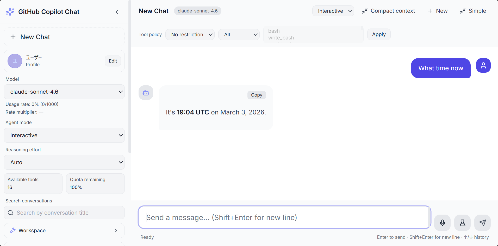
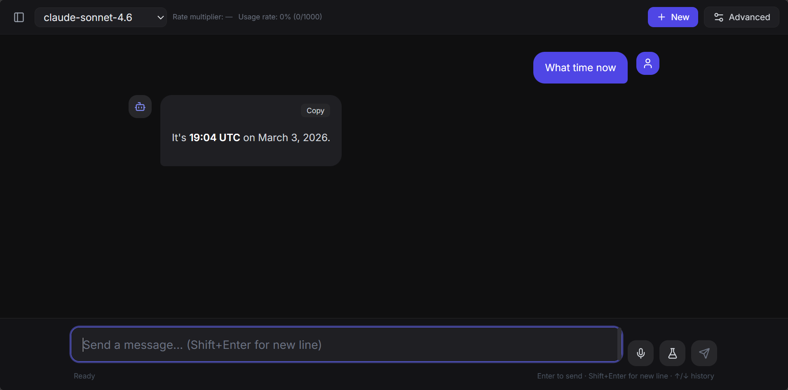
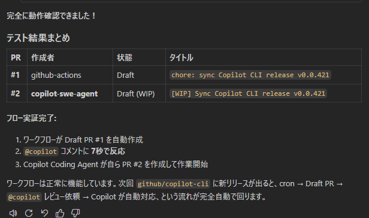

# gh-copilot-chat-app

> Unofficial community project. Not affiliated with GitHub.

Modern Claude / ChatGPT-like chat interface powered by GitHub Copilot SDK.


## Language

- English (base): this file (`README.md`)
- 日本語: [README.ja.md](README.ja.md)

## Download

> **Want to try it out?** Go to the [Releases page](https://github.com/aktsmm/gh-copilot-chat-app/releases) to download the latest desktop app (Windows ZIP).

## Demo

|                  Advanced Mode                  |                 Simple Mode                 |
| :---------------------------------------------: | :-----------------------------------------: |
|  |  |

|               CI/CD Workflow Test               |
| :---------------------------------------------: |
|  |

- Demo video: [docs/demo-video.mp4](docs/demo-video.mp4)

## Highlights

- Real-time streaming chat via Socket.IO
- Multi-session conversation management
- Per-session model / mode / tool policy controls
- Web-search fallback support for search-style prompts
- Electron desktop packaging (Windows/macOS/Linux)

## CI/CD — Automatic Feature Tracking

This project includes automated workflows to keep pace with upstream Copilot CLI changes:

| Workflow                 | Trigger                | Purpose                                                                                                            |
| ------------------------ | ---------------------- | ------------------------------------------------------------------------------------------------------------------ |
| `cli-release-auto-pr`    | cron (8 h) / manual    | Detects new `github/copilot-cli` releases, updates model lists, creates a Draft PR, and requests `@copilot` review |
| `smoke-vite-server-url`  | Pull Request           | Runs lint, typecheck, unit tests, and Vite smoke test                                                              |
| `release-desktop-assets` | GitHub Release publish | Builds Windows ZIP assets and uploads artifacts                                                                    |

> The `@copilot` review step uses **GitHub Copilot Coding Agent** to automatically review Draft PRs created by the automation.

## Requirements

1. Node.js 20+
2. GitHub Copilot CLI installed and authenticated
3. Valid Copilot subscription (or BYOK setup)

## 🚀 Quick Start (EXE Installer)

For users who just want to run the app without touching code.

> **How it works**: This app internally spawns the **GitHub Copilot CLI** (`copilot` command) as a child process to communicate with GitHub's AI.
> The EXE alone won't work — you need to **install the Copilot CLI and authenticate first**.

### Prerequisites

| Requirement                 | Where to get it                                                    | Notes                                    |
| --------------------------- | ------------------------------------------------------------------ | ---------------------------------------- |
| **Node.js 20+**             | [nodejs.org](https://nodejs.org/)                                  | Required to install the Copilot CLI      |
| **GitHub Copilot CLI**      | `npm i -g @github/copilot`                                         | The communication engine used internally |
| GitHub account              | [github.com](https://github.com)                                   | Free                                     |
| GitHub Copilot subscription | [github.com/features/copilot](https://github.com/features/copilot) | Free plan available                      |

### Step 1 — Install Node.js

Download **LTS** from [nodejs.org](https://nodejs.org/) and install.
Skip if already installed (`node --version` to check).

### Step 2 — Install & authenticate the Copilot CLI

```powershell
# Install globally
npm i -g @github/copilot

# Authenticate (opens browser for login)
copilot auth login

# Verify
copilot --version
```

### Step 3 — Download the installer

Go to the [Releases page](https://github.com/aktsmm/gh-copilot-chat-app/releases/latest) and download
`GitHub Copilot Chat Setup <version>.zip`, then run it.

> If you see `NSIS Error (Installer integrity check has failed)`, re-download the ZIP package and run the extracted EXE.

```
GitHub Copilot Chat Setup x.x.x.zip  ← extract first
└ GitHub Copilot Chat Setup x.x.x.exe  ← double-click this
```

> If Windows SmartScreen shows a warning, click "More info" → "Run anyway".

### Step 4 — Launch

After installation, click **GitHub Copilot Chat** from the desktop shortcut or Start Menu.

### Troubleshooting

| Symptom                      | Fix                                                    |
| ---------------------------- | ------------------------------------------------------ |
| `copilot: command not found` | Re-check Steps 1 & 2. Restarting the terminal may help |
| `node: command not found`    | Install Node.js in Step 1 and try again                |
| Authentication error         | Run `copilot auth login` again                         |
| Blank white screen           | Right-click the taskbar icon → Restart                 |

---

## Quick Start (Developer)

```bash
npm install
npm run preflight
npm run dev
```

This starts server (http://127.0.0.1:3001) and client (http://localhost:5173).
Depending on your environment, http://127.0.0.1:5173 may refuse while localhost works; prefer the Vite Local URL shown in terminal output.

## Build

```bash
npm run build
npm start
```

## Desktop Build (Windows)

```bash
npm run build:desktop
```

Expected installer output:

- desktop/dist/GitHub Copilot Chat Setup <version>.exe

Portable folder output (recommended for non-installer use):

- desktop/dist/win-unpacked/

## Pre-release Checklist

1. Run quality checks
   - npm run typecheck
   - npm run test -w server
2. Rebuild desktop installer after latest source changes
3. Ensure secrets are not included (.env, tokens, local credentials)
4. Exclude temporary files and local artifacts from commits

## Release Assets (Recommended)

- Do not commit distributables (EXE) to the repository.
- Attach them as GitHub Release Assets.
- On `Release published`, [release-desktop-assets.yml](.github/workflows/release-desktop-assets.yml) builds and uploads:
  - GitHub Copilot Chat Setup <version>.zip
  - GitHub Copilot Chat Portable <version>.zip (extracted-folder style)
  - SHA256SUMS.txt
- The workflow validates that release `tag` (without leading `v`) matches all workspace `package.json` versions.
- For manual execution, use workflow_dispatch and provide `tag`.

## Notes

- Full Japanese guide: [README.ja.md](README.ja.md)
